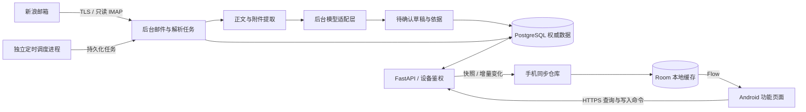

# CardCue 架构与数据口径

更新日期：2026-09-17。本文区分当前实现与用户已确认的目标架构；目标设计不代表代码已实现。

## 已确认的架构决定

| 决策 | 目标方案 |
|---|---|
| 邮件读取 | 后台定时读取新浪邮箱，手机不执行 IMAP |
| 账单存储 | 后台统一保存权威数据，手机 Room 保存本地缓存，App 启动时同步 |
| 模型调用 | 后台统一调用，模型密钥不进入 App |
| 功能组织 | Android 按首页、账单、账户、同步拆分；公共能力单独组织 |
| 业务模型 | 独立账户、卡片、账单、邮件来源和账单版本模型 |

继续保留 Kotlin + Compose + Room、Python 3.11+ + FastAPI。共用账户多卡不重复计账，各币种分别汇总；还款记录不代表转账，撤销留痕；所有账单金额使用整数最小货币单位。

## 当前实现边界

当前 App 仍是本地演示版本：Compose → ViewModel → BillRepository → Room v1，包含 statements、payments、app_meta 三张表，无后台同步。后台只有 /health、/v1/capabilities 和解析字段草案。

正在进行的 P0 改造已增加 Application 数据库提供入口、测试专用 Application、首页 HomeRules、统计测试及新的设备测试。主程序构建、单元测试和 Lint 已通过；新增设备测试曾在编译阶段失败，修正后尚未完整重跑。以上改动不表示云端架构已经落地。

## 目标结构

采用模块化单体后台，先不引入微服务。工程默认选择 PostgreSQL + SQLAlchemy 2 + Alembic；API、定时调度与任务处理分别运行，共享服务层和数据库。



### 后台职责

- 定时只读收取邮件，持续记录同步游标、任务进度、失败与重试；手机关闭不影响收件。
- 清理 HTML、提取附件、调用模型，生成带依据的草稿，不自动将模型输出记为正式欠款。
- 保存账户、卡片、草稿、正式账单、版本、还款与撤销记录，以及来源关联。
- 用户通过手机核对和确认后，后台事务校验并入账。余额、去重与并发校验以后台为准。
- 提供手机同步、在线写入、任务状态、备份和恢复能力。

### 手机职责

- 启动后先显示上次成功同步的缓存，再自动请求后台；没有缓存时显示加载或连接失败，不能把同步失败显示为零欠款。
- 支持手动刷新，展示最后成功同步时间、同步中、离线、失败与待确认草稿数量。
- 提交账户维护、草稿确认、还款和撤销命令；后台确认成功后更新缓存，并继续拉取变化。
- 首版联网才能写入，离线只读。暂不做离线写入队列，不乐观扣减待还金额，也不向用户宣称未提交的还款已记录。
- 手机仅持有本应用设备凭证，不持有邮箱授权码或模型密钥。

此离线策略是本轮工程默认选择，后续如需离线记账，另设计待提交队列、重放和冲突交互。

## 目标业务模型

以下为逻辑实体，具体字段在第一批服务端迁移中确定；表结构目前尚未创建。

| 实体 | 职责与主要关联 |
|---|---|
| Owner / Device | 个人数据归属与多个获授权设备；首版不做公开注册和复杂多租户管理 |
| Account | 银行侧账单账户，稳定 UUID；账户别名可修改，不以尾号作主键 |
| Card | 关联 Account；保存展示名、尾号、状态，不保存完整卡号 |
| Statement | 一期账户账单的稳定身份；按归属、账户、确认的账期及币种防重，指向当前有效版本 |
| StatementCard | 账单与卡片关联快照，避免以后卡片变更影响历史展示 |
| StatementVersion | 不可变的账单版本、金额、日期、修正原因、确认人/时间及来源；只统计当前有效版本 |
| StatementDraft / Evidence | 模型或人工草稿、逐字段依据、缺失/冲突原因、待补充/待确认/已确认/已拒绝等状态 |
| Payment | 指向稳定 Statement 身份；整数金额、币种、记录时间、备注与撤销时间，保留审计信息 |
| Mailbox / MailCursor | 后台邮箱配置、加密凭证、文件夹、UIDVALIDITY、UID 和收件状态 |
| EmailSource / Attachment | 邮件标识、内容指纹、附件元数据、受保护内容引用；与版本/草稿通过关联表连接 |
| Job / ParseAttempt | 收件及解析任务、租约、重试次数、输入版本、耗时与费用；不把正文写入任务日志 |
| ChangeLog / IdempotencyRecord | 手机同步的提交序号与变更快照，以及重复请求的结果记录 |

数据规则：

- 账户与尾号分离；同尾号跨银行或跨账户不能自动合并。一个账户有多卡时仍只生成一份相应币种账单。
- 金额使用 BIGINT/Long，接口使用 JSON 整数，附币种。缺失金额保持 null，不能改为 0；超范围、非整数和非法精度须明确拒绝。
- 账期不能仅由邮件到达月份推测，先完成字段提取或人工确认再建立唯一身份。
- 补发邮件可以关联同一账单版本；更正版生成新版本，不额外累加一份欠款，不静默覆盖人工修正。
- 负余额/溢缴款作为明确业务状态处理，不强行写入当前非负待还模型。跨期结转要核对，避免同时统计旧欠款与已包含该欠款的新账单。
- 若更正后的应还低于已有有效还款，阻止直接生效并进入冲突处理，不删除还款或产生伪造余额。
- 原始内容与结构化账单分开存储。后台保留必要来源与依据；原文/附件加密暂存，设置保留期限和清理任务。过期原文不可核对时明确标记，不伪称仍有依据。
- 后台时间使用 UTC，日期字段保持银行账单日期语义；客户端按设备时区显示操作时间。

## 手机同步协议

### 启动、刷新与全量同步

1. 设备鉴权完成后，读取按“后台实例 + Owner”隔离的 Room 缓存。
2. 首次同步获取带快照标识和水位的分页快照。服务端保证分页期间同一快照的一致性。
3. 客户端写入暂存区，全部成功后在事务中激活快照与游标。分页失败保留旧缓存，不以不完整快照覆盖旧数据。
4. 后续从已提交游标拉取变化，响应包括记录版本和删除/归档标记；每批数据与下一游标在同一 Room 事务中提交。
5. 同步中断可从已提交位置继续；重复拉取按稳定 ID 与版本处理，不重复生成账单或还款。

后台变更日志与业务写入同事务提交。每个 Owner 使用事务内串行分配的提交序号，例如锁定同步版本行后递增，避免普通数据库 sequence 先分配后乱序提交造成漏同步。增量分页固定上界，返回对应版本的变化快照，不能仅以更新时间或读取最新实体拼接历史游标。

游标包含后台数据世代；备份恢复、更换实例或历史日志过期时返回“需要全量同步”。重建服务端缓存不能删除旧本地待迁移数据。不同后台/Owner 的缓存不可混用。

### 写入、重试与冲突

- 还款、撤销、草稿确认等命令携带客户端生成的请求 UUID。相同请求在网络重试后返回原结果，不能重复入账。
- 同一请求 UUID 携带不同内容时返回冲突；客户端超时后先查询或重试同一请求，不能换 UUID 猜测重做。
- 服务端事务锁定目标账单或相应账本行，重新计算有效还款及剩余金额，校验后写入；不能相信手机传来的剩余金额。
- 撤销保留原记录；重复撤销同一记录返回已撤销状态，不重复改变金额。
- 账户修改、草稿确认、账单更正使用 expected_version 等乐观并发条件。版本过期返回冲突，由手机刷新并重新核对，不按最后写入覆盖。
- 写入返回已提交实体及版本，但手机不能直接把全局同步游标跳到这个版本而漏掉其他变化；仍从原游标拉取。
- 同步和写入响应乱序时仅接纳更新版本，避免旧缓存覆盖刚确认的结果。

## 后台定时收件与解析

- 首版默认每 30 分钟调度一次，可配置；首次最近三个月，后续增量。此为程序内的目标调度策略，本次未启用任何实际收件任务。
- 调度器使用独立入口，不放在 FastAPI 每个 worker 的启动事件中。持久化任务、邮箱级租约和唯一约束防止多进程重复执行。
- 定时触发与“立即收取邮件”共用任务队列，同一邮箱同一时段不重叠执行。
- 使用至少一次执行加幂等处理；保存安全检查点，进程崩溃后恢复。断网限次退避重试，鉴权失败停止自动重试并显示待处理。
- IMAP 按邮箱 + 文件夹 + UIDVALIDITY + UID 标识邮件，使用只读选择和 BODY.PEEK 等方式，不改已读、不删邮件。UIDVALIDITY 变化时重新扫描并按指纹判重。
- 邮件传输去重、业务账单去重和更正版判定分开；Message-ID、尾号、发件地址均不足以独立作为真实性或唯一性证明。
- 模型调用按输入指纹、提取版本、提示词/模型配置缓存结果。调用超时而供应商是否计费未知时记录不确定状态，不宣称能保证外部调用恰好一次。
- 普通“刷新账单”只拉取已有后台数据；“立即收取邮件”显式创建后台任务，手机展示任务进度，不阻塞首页加载。

## 代码组织与接口方向

先按功能包和清晰依赖拆分，保持单 Android Gradle 模块；后续确有构建或复用需求再拆多模块。

```text
android/.../app/
  app/                  Application、入口、导航和依赖组装
  core/model/           独立业务模型，不依赖 Room 实体或 HTTP DTO
  core/domain/          金额、日期、展示规则
  core/network/         HTTPS、设备凭证、请求与错误映射
  core/database/        Room 缓存、旧数据迁移、同步游标
  core/designsystem/    主题与复用组件
  feature/home/         首页与各币种合计
  feature/statements/   详情、历史、草稿确认、还款与撤销
  feature/accounts/     账户与卡片维护
  feature/sync/         启动同步、状态与任务进度
  feature/settings/     后台地址、设备信息与设置

backend/cardcue_api/
  api/                  路由、鉴权、输入输出契约
  domain/               账户、账单、版本、还款规则
  services/             事务、确认入账、同步、任务编排
  persistence/          SQLAlchemy 模型、仓库、数据库会话
  mail/                 IMAP 与 MIME 处理
  parsing/              提取器、模型适配器、草稿校验
  jobs/                 调度器与任务处理入口
  migrations/           Alembic 明确迁移
```

页面依赖功能 ViewModel/用例与仓库接口，不直接调用 IMAP 或模型；Room 实体、网络 DTO 与业务模型分别映射。App 级状态只保存当前设备/后台连接与导航，不集中管理全部功能。

拟定接口分组（待实现，现有能力声明继续为 false）：

| 分组 | 操作 |
|---|---|
| 设备与会话 | 配对、令牌更新、撤销设备 |
| 账户与卡片 | 查询、创建、修改、归档 |
| 账单与草稿 | 查询、依据查看、人工修改、确认、版本历史 |
| 还款记录 | 新增、撤销、按请求 UUID 查询结果 |
| 数据同步 | 一致性快照、增量变化、游标失效处理 |
| 邮件任务 | 收件状态、触发立即收件、取消/重试受支持任务 |

## 凭证、部署与备份

- 邮箱授权码移到后台加密保存，加密主密钥与数据库分离；模型密钥由部署环境或秘密管理服务提供。手机和日志中不出现这两类密钥。
- 个人使用优先设备配对，不做公开注册。初次配对使用一次性凭据，后台存储不可逆令牌摘要并支持撤销；Android Keystore 保护设备凭证。
- 开发服务仍只绑定本机；远程手机接入必须先具备 HTTPS、鉴权、请求限制及对象归属校验。数据库与任务进程不直接暴露公网。
- API、任务进程和调度器独立启动，健康检查区分 API 存活、任务积压、最近成功收件时间，不把后台异常伪装成无账单。
- 真实试用前完成后台数据库、受保护内容及独立密钥的备份恢复演练；手机缓存不承担唯一备份职责。恢复后更新同步世代，旧客户端重新同步。

## 现有本地数据迁移

1. 保留 cardcue.db 和现有账单/还款/撤销记录，迁移前提供可恢复备份，不卸载或清库。
2. Room 明确升级，区分旧本地数据与服务端缓存。当前内置演示账单及其手工还款保留为旧演示数据，不自动上传为正式债务。
3. 如确有需导入的本地非演示记录，提供预览和人工账户映射，经确认后按稳定导入 ID 幂等导入后台；不根据尾号猜账户。
4. 导入确认后拉取服务端结果，并记录旧 ID 到后台 ID 的映射。失败保留旧数据和进度，不产生半套账单或重复还款。
5. 正式模式只汇总后台确认的正式账单；保留旧演示数据查看入口。后台空库或首次同步失败不能触发删除旧记录。

新架构完成前，现有本地版本保持原有使用方式。数据库迁移、后台接入与模式切换必须有独立测试和明确验证结果。
